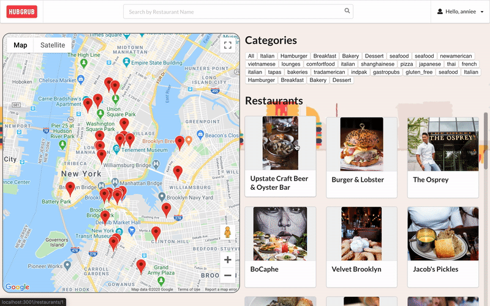
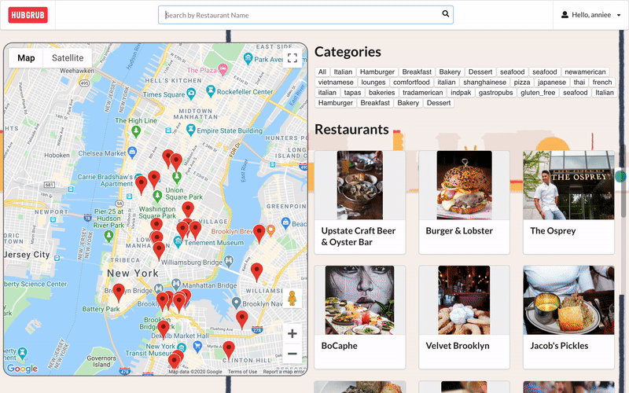
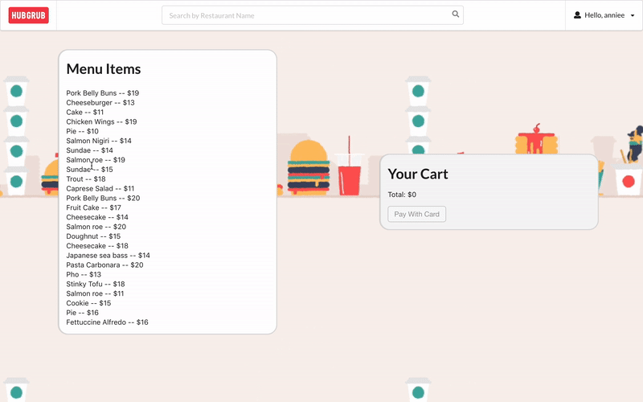
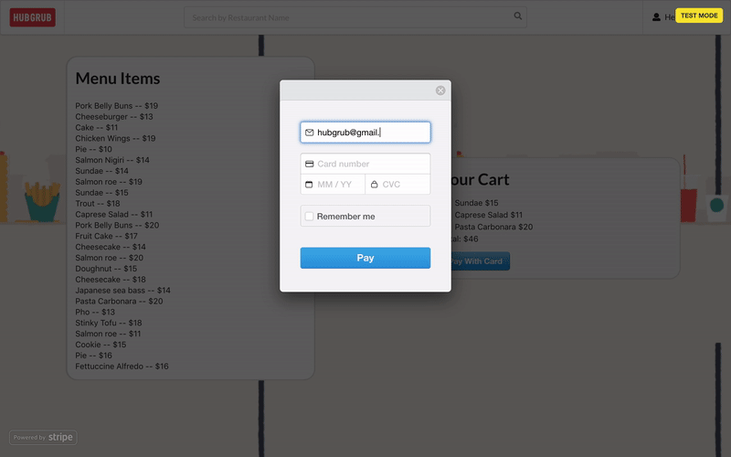
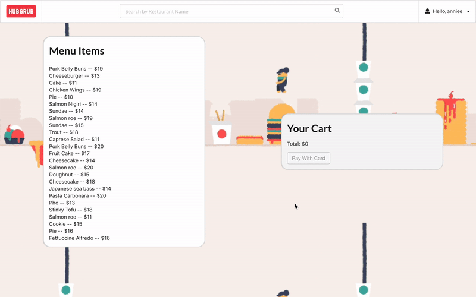
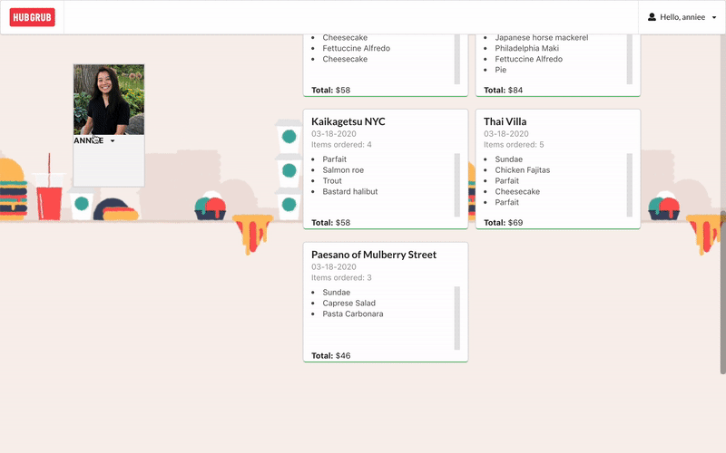

<h1 align="center">HubGrub 🌯 🍱</h1>

  A <code>React</code> web app designed as a food delivery application that connects diners to restaurants. 

 

## Tech Stack
This web app makes use of the following:

[**Backend**](https://github.com/bigfishh/hubgrub-api)
- Ruby [2.6.1]
- Rails [~> 5.2.3] - MVC web framework used as an API
- Bcrypt [~> 3.1.7] - Gem for encryption and securing user passwords
- Dotenv - Rails gem for securing API Keys
- Faker - Rails gem used to easily generate fake data: menu items
- Yelp-Fusion - Ruby gem used to process data from the Yelp API
- Active Model Serializers - Serializing API routes to JSON
- JWT - securing tokens
- PostgreSQL [>= 0.18, < 2.0] - Database

**Front End** 
- React.js
- React Router - Declarative Routing
- Semantic UI React 
- Custom CSS3 styling 
- Google Maps React API
- Stripe API

## Installing

**Backend Installation:**

- Clone [backend repo](https://github.com/bigfishh/hubgrub-api) to your local machine `git clone <backend-repo-url>`
- run `bundle install` to install required dependencies
- Ensure you have PostgreSQL running
- run `rails db:create` to create a database locally.
- run `rails db:migrate` to create tables into the database.
- run `rails db:seed` to create seed data.
- run `rails s` to run the server. 

**Frontend Installation:**

- Clone this repo to your local machine `git clone <this-repo-url>`
- Ensure your Backend API is running at `http://localhost:3000/`
- run `npm install` to install all dependencies
- run `npm start` to start server
- When prompted, ensure Frontend is running at `http://localhost:3001`

## Features

Users are able to sign up and sign in. Upon signing in, users are taken to their home page.

User is able to see a list of restaurants in the New York City area via a list and on Google Maps. User is able to use buttons to filter restaurants based on categories. 

User is able to search by restaurant name.

User is able to to click on a restaurant card and be taken to one specific restaurant where menu items are displayed. User is able to add and remove items from cart. 

Upon checkout, user is able to enter their credit card information.

User is able to go to their profile page and see their confirmed order. 

User is able to delete their account or log out. 

